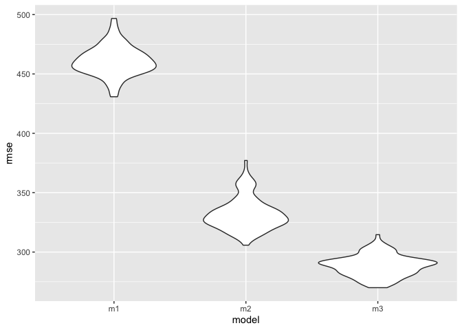
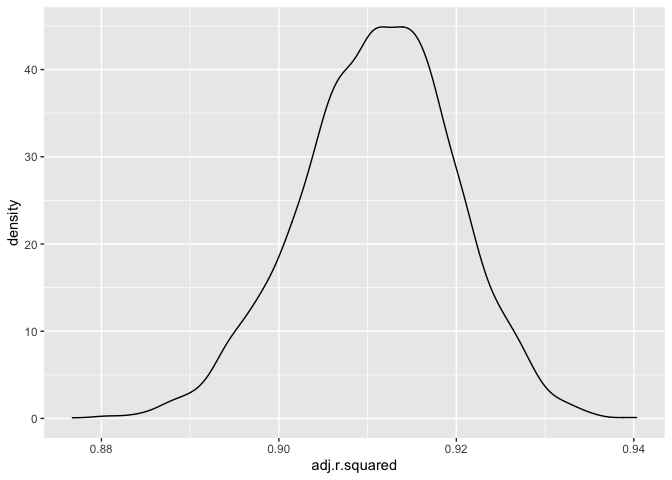
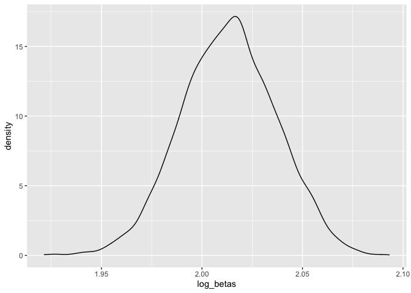

Homework 6
================
Vera Xu

This is my solution to HW6.

``` r
homicide_df = 
  read_csv("data/homicide-data.csv", na = c("", "NA", "Unknown")) %>% 
  mutate(
    city_state = str_c(city, state, sep = ", "),
    victim_age = as.numeric(victim_age),
    resolution = case_when(
      disposition == "Closed without arrest" ~ 0,
      disposition == "Open/No arrest"        ~ 0,
      disposition == "Closed by arrest"      ~ 1)
  ) %>% 
  filter(
    victim_race %in% c("White", "Black"),
    city_state != "Tulsa, AL") %>% 
  select(city_state, resolution, victim_age, victim_race, victim_sex)
```

Start with one city.

``` r
baltimore_df =
  homicide_df %>% 
  filter(city_state == "Baltimore, MD")
glm(resolution ~ victim_age + victim_race + victim_sex, 
    data = baltimore_df,
    family = binomial()) %>% 
  broom::tidy() %>% 
  mutate(
    OR = exp(estimate),
    CI_lower = exp(estimate - 1.96 * std.error),
    CI_upper = exp(estimate + 1.96 * std.error)
  ) %>% 
  select(term, OR, starts_with("CI")) %>% 
  knitr::kable(digits = 3)
```

| term              |    OR | CI\_lower | CI\_upper |
| :---------------- | ----: | --------: | --------: |
| (Intercept)       | 1.363 |     0.975 |     1.907 |
| victim\_age       | 0.993 |     0.987 |     1.000 |
| victim\_raceWhite | 2.320 |     1.648 |     3.268 |
| victim\_sexMale   | 0.426 |     0.325 |     0.558 |

Try this across cities.

``` r
models_results_df = 
  homicide_df %>% 
  nest(data = -city_state) %>% 
  mutate(
    models = 
      map(.x = data, ~glm(resolution ~ victim_age + victim_race + victim_sex, data = .x, family = binomial())),
    results = map(models, broom::tidy)
  ) %>% 
  select(city_state, results) %>% 
  unnest(results) %>% 
  mutate(
    OR = exp(estimate),
    CI_lower = exp(estimate - 1.96 * std.error),
    CI_upper = exp(estimate + 1.96 * std.error)
  ) %>% 
  select(city_state, term, OR, starts_with("CI")) 
```

``` r
models_results_df %>% 
  filter(term == "victim_sexMale") %>% 
  mutate(city_state = fct_reorder(city_state, OR)) %>% 
  ggplot(aes(x = city_state, y = OR)) + 
  geom_point() + 
  geom_errorbar(aes(ymin = CI_lower, ymax = CI_upper)) + 
  theme(axis.text.x = element_text(angle = 90, hjust = 1))
```

<!-- -->

## Problem 2

``` r
bw_df = 
  read_csv("data/birthweight.csv") %>%
  mutate(
         babysex = as.factor(babysex),
         frace = as.factor(frace),
         malform = as.factor(malform),
         mrace = as.factor(mrace)
         ) %>%
  select(bwt, everything())
```

The birthweight data contains 4342 rows, and no missing data.

#### Fit model of my own choice

I’m referring to an article that introduces birthweight predictor
factors. Race, mother’s age, multiple birth and mother’s health
condition influences birthweight. Based on this article, the variables I
chose as predictor variables are:

  - mother’s age at delivery

  - father’s race

  - mother’s race

  - number of live births prior to this pregnancy

  - mother’s pre-pregnancy BMI

  - average number of cigarettes smoked per day during pregnancy

  - mother’s weight at delivery.

Full article can be accessed at:
<https://www.childrenshospital.org/conditions-and-treatments/conditions/l/low-birthweight-in-newborns/symptoms-and-causes>.

**Model \#1**: bwt \~ momage + frace + mrace + parity + ppbmi + smoken +
wtgain

``` r
m1 = lm( bwt ~ momage + frace + mrace  + parity + ppbmi + smoken + wtgain, data = bw_df)

m1 %>%   
  broom::tidy() %>%
  select(term, estimate, p.value) %>% 
  knitr::kable(digits = 5)
```

| term        |    estimate | p.value |
| :---------- | ----------: | ------: |
| (Intercept) |  2441.54586 | 0.00000 |
| momage      |     6.22035 | 0.00152 |
| frace2      | \-128.90444 | 0.09677 |
| frace3      |  \-69.19311 | 0.55340 |
| frace4      | \-117.94769 | 0.11688 |
| frace8      |  \-29.09876 | 0.81553 |
| mrace2      | \-222.99489 | 0.00405 |
| mrace3      |  \-76.86137 | 0.52543 |
| mrace4      | \-120.81478 | 0.11047 |
| parity      |  \-52.52463 | 0.43911 |
| ppbmi       |    22.70807 | 0.00000 |
| smoken      |  \-11.82928 | 0.00000 |
| wtgain      |    12.48942 | 0.00000 |

``` r
bw_df %>% 
  add_predictions(model = m1, var = "pred") %>% 
  add_residuals(model = m1, var = "resid") %>%
  ggplot(aes(x = pred, y = resid)) + 
  geom_point(alpha = 0.2) +
  geom_smooth(se = F, color = "red", method = "lm") + 
  xlab("predictions") + 
  ylab("residuals")
```

<!-- -->

Based on the residual plot, the residual is basically randomly
distributed along the x axis with some larger negative values when
predictied values are around 2500 \~ 3250. This model look basically
fine, but might not be the best fitted model.

**Model \#2**: bwt \~ blength + gaweeks

**Model \#3**: bwt \~ babysex + blength + bhead + babysex \* blength +
babysex \* bhead + blength \* bhead + babysex \* blength \* bhead

``` r
bw_cv_df =
    crossv_mc(bw_df, 100) %>% 
    mutate(train = map(train, as_tibble),
           test = map(test, as_tibble))

bw_cv_df =
    bw_cv_df  %>% 
  mutate(
    m1 = map(train, ~lm(bwt ~ momage + frace + mrace  + parity + ppbmi + smoken + wtgain, data = .x)),
    m2 = map(train, ~lm(bwt ~ blength + gaweeks,  data = .x)),
    m3 = map(train, ~lm(bwt ~ babysex + blength + bhead + babysex * blength + babysex * bhead + blength * bhead + babysex * blength * bhead, data = .x))
    ) %>% 
  mutate(
    rmse_m1 = map2_dbl(m1, test, ~rmse(model = .x, data = .y)),
    rmse_m2 = map2_dbl(m2, test, ~rmse(model = .x, data = .y)),
    rmse_m3 = map2_dbl(m3, test, ~rmse(model = .x, data = .y)))

bw_cv_df %>% 
  select(starts_with("rmse")) %>% 
  pivot_longer(
    everything(),
    names_to = "model", 
    values_to = "rmse",
    names_prefix = "rmse_") %>% 
  mutate(model = fct_inorder(model)) %>% 
  ggplot(aes(x = model, y = rmse)) + 
  geom_violin()
```

<!-- -->

From this rmse plot, model 3 is the best model as it has the lowest
rmse. The best model among these three candidates is to use **head
circumference, length, sex, and all interactions** to predict baby’s
birthweight.

## Problem 3

``` r
weather_df = 
  rnoaa::meteo_pull_monitors(
    c("USW00094728"),
    var = c("PRCP", "TMIN", "TMAX"), 
    date_min = "2017-01-01",
    date_max = "2017-12-31") %>%
  mutate(
    name = recode(id, USW00094728 = "CentralPark_NY"),
    tmin = tmin / 10,
    tmax = tmax / 10) %>%
  select(name, id, everything())
```

The dataset for this problem has 365 rows. The variables in this dataset
are: date, id, name, prcp, tmax, tmin.

Now use the **boot\_sample** function to draw bootstrap samples.

``` r
boot_sample = function(df) {
  
  sample_frac(df, replace = TRUE)
  
}
```

#### Analyzing R squared.

``` r
boot_straps = 
  data_frame(
    strap_number = 1:5000,
    strap_sample = rerun(5000, boot_sample(weather_df))
  )
```

    ## Warning: `data_frame()` is deprecated as of tibble 1.1.0.
    ## Please use `tibble()` instead.
    ## This warning is displayed once every 8 hours.
    ## Call `lifecycle::last_warnings()` to see where this warning was generated.

``` r
bootstrap_results_1 = 
  boot_straps %>% 
  mutate(
    models = map(strap_sample, ~lm(tmax ~ tmin, data = .x) ),
    results = map(models, broom::glance)) %>% 
  select(-strap_sample, -models) %>% 
  unnest(results) 

bootstrap_results_1 %>%
  ggplot(aes(x = adj.r.squared)) + 
  geom_density()
```

<!-- -->

From the plot of adjusted R square, we can see that its distribution
looks like normal distribution, with a peak between 0.90 and 0.92.

The 95% CI of adjusted R square is: (0.8934048 , 0.9272809).

#### Analyzing log of the product of betas.

``` r
log_beta_p = function(df) {
    log(df[1,2]*df[2,2]) %>% 
    tibble() %>% 
    mutate(
      log_betas=.$estimate) %>% 
    select(log_betas)
}
```

``` r
bootstrap_results_2=
  boot_straps %>% 
  mutate(
    models = map(strap_sample, ~lm(tmax ~ tmin, data = .x) ),
    results = map(models, broom::tidy),
    log_betas = map(results, log_beta_p)) %>% 
  select(-strap_sample, -models) %>%
  unnest(log_betas)
```

``` r
bootstrap_results_2 %>%
  ggplot(aes(x = log_betas)) + 
  geom_density()
```

<!-- -->

From the plot of log of the product of betas, we can see that its
distribution also looks like normal distribution, with a peak between
2.00 and 2.025.

The 95% CI of log of the product of betas is: (1.9669417 , 2.0585284).
